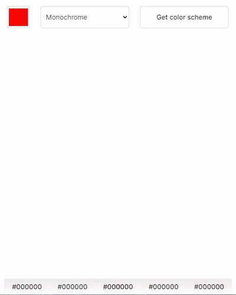

# Color-Scheme-Generator
<b>You can easily generate a color scheme for the seed color you choose.</b>

## Strech Goal
<b>Click hex values to copy to clipboard. </b>:white_check_mark:

-------

<i>This project was a solo project that I accomplished by myself. The design idea was given by <a href="https://scrimba.com/">Scrimba</a> from a course project in the Frontend Developer Career Path.</i>